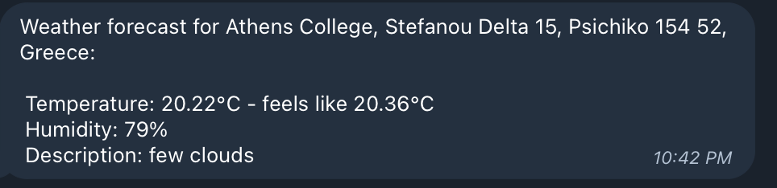

# Telegram Weather Bot

Get weather notifications for google calendar events in telegram.

# Prerequisites
* python3
* pipenv

# Configuration

Create a `local.env` and set your API keys (see `example-local.env`).

# Installation

```
pipenv install
```

# Run

```
pipenv shell # skip if you just ran `pipenv install`
cd src
python job.py [--dry-run]
```

# Results

You'll receive a message in your bot's Telegram chat with the weather forecast.


